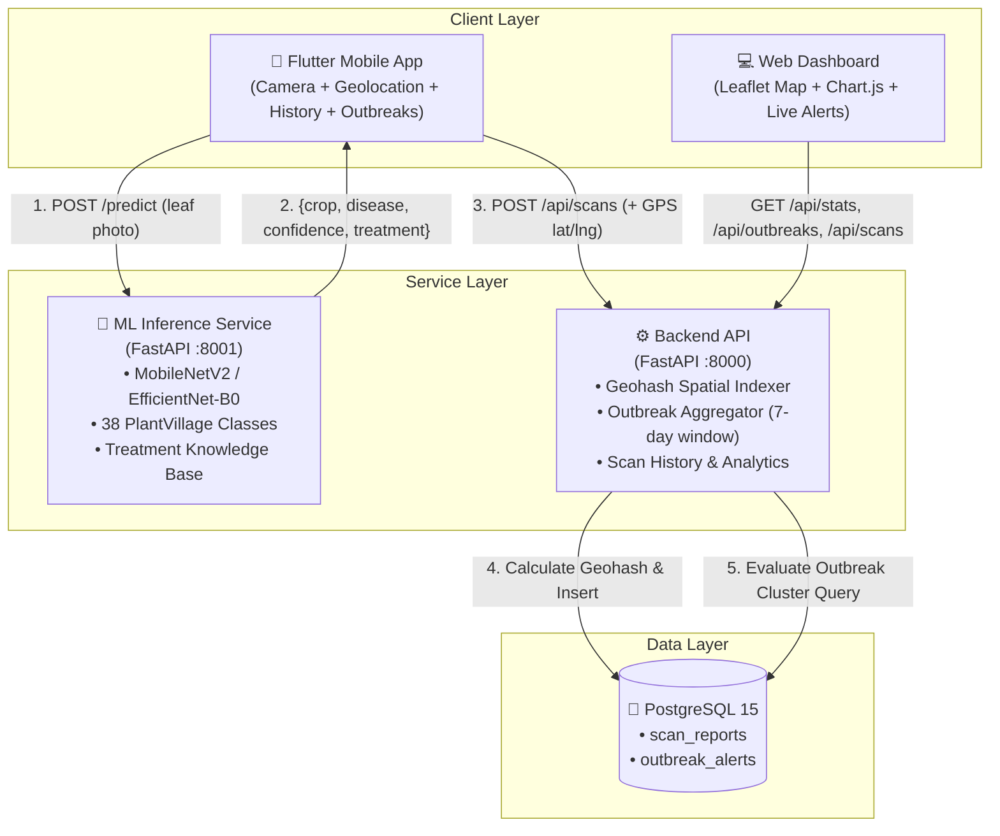

# KrishiRakshak — System Architecture

**Farmers Disease Diagnostic & Regional Outbreak Surveillance Portal**

## 1. High-Level Architecture

---

## 2. Component Breakdown

### A. Machine Learning Pipeline (`/ml`)
- **Dataset**: PlantVillage benchmark (14 crops, 38 diseased & healthy classes).
- **Architecture**: Transfer learning on `MobileNetV2` and `EfficientNet-B0` backbones with ImageNet initialization and a 2-layer dense classifier head with Dropout.
- **Class Imbalance Strategy**:
  - Inverse-frequency weighted `CrossEntropyLoss` ($w_i = \frac{N}{C \cdot n_i}$).
  - Tiered data augmentation: aggressive affine, blur, and random erasing for minority classes ($n < 500$ images, e.g., Potato Healthy).
  - Optional `WeightedRandomSampler` for balanced epoch sampling.
- **Serving**: FastAPI service returning top-1 diagnosis, top-3 confidence rankings, and agronomically verified treatment recommendations in $<500$ms.

### B. Backend API (`/backend`)
- **Framework**: FastAPI (Python 3.11) + SQLAlchemy 2.0.
- **Geospatial Engine**: Geohash grid indexing (precision 5 = ~4.9 km cells) for efficient spatial grouping without heavy PostGIS overhead.
- **Outbreak Detection**:
  - Rolling window: 7 days.
  - Outbreak condition: $\ge 3$ distinct `device_id` reporting the same non-healthy disease in the same ~5km geohash cell.

### C. Mobile Application (`/mobile`)
- **Framework**: Flutter (Dart).
- **Features**:
  - Live camera photo capture and gallery import.
  - Instant leaf diagnosis with confidence percentage and actionable treatments.
  - Automatic geolocation tagging with background scan logging.
  - Personal scan history with offline SQLite / backend sync.
  - Community Outbreak alerts feed for regional early warning.

### D. Regional Dashboard (`/dashboard`)
- **Framework**: Modern vanilla HTML5 / CSS3 / JavaScript (zero build step).
- **Features**:
  - Real-time interactive map (Leaflet.js) displaying field scan locations color-coded by disease severity.
  - Live community outbreak alert cards with case counters and affected geohash zones.
  - Top 10 disease frequency distribution chart (Chart.js).
  - Auto-refresh surveillance feed every 30 seconds.
